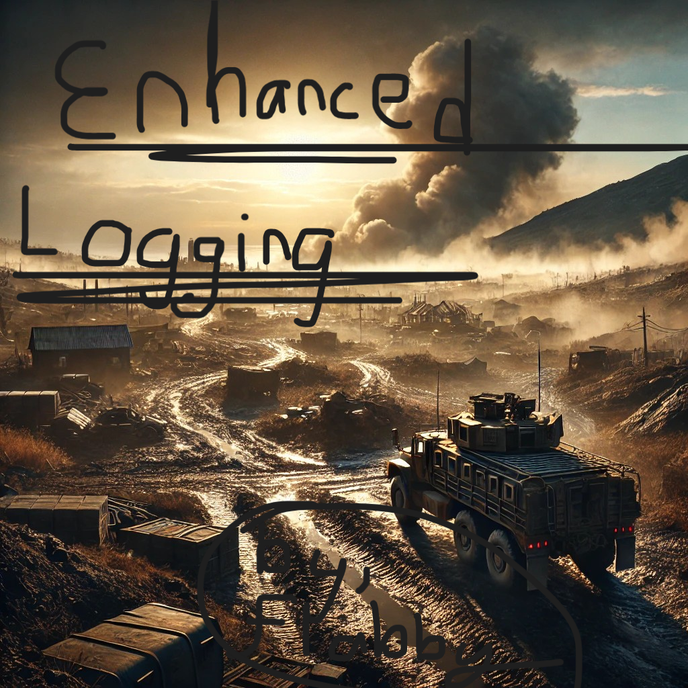

# Amra Reforger Mod Workshop
[Arma Reforger Workshop](https://reforger.armaplatform.com/workshop/6316335D6A19E51C)

# Description
**Introducing Enhance Logging by "flabby" for Arma Reforger**  

Take control of your server’s data like never before with Enhance Logging, a powerful, customizable logging system designed to elevate your server management experience.  

### **Key Features:**  
- **Detailed & Persistent Logs**: Track every critical event with logs stored locally as `.json` files.  
- **Customizable Extension**: Choose your file style—.json, .txt, or .log—tailored to your workflow.  
- **Developer Tools**: Access essential debugging data like system/server time, with seamless format changes via in-game commands.  

### **Designed for Power Users**  
Whether you’re a developer or a server operator, Enhance Logging is your solution for reliable tracking. The system currently focuses on `SCR_GameMode` logs.

### **Folder Structure Made Simple**  
Your logs are neatly organized in `ServerProfile/flabby/YEAR/MONTH/DAY`. Open and format them effortlessly with tools like VSCode or your preferred methods.  

### **Easy-to-Use Commands:**  
- **#loghelp**: List all available commands.  
- **#log file [TRUE|FALSE]**: Control log to files.  
- **#log print [TRUE|FALSE]**: Control log to server console.  
- **#log extension [JSON|LOG|TXT]**: Choose your file format.  

**Examples:**  
- `#loghelp`  
- `#log file false`  
- `#log print true`
- `#log extension json`  

**Download Enhance Logging now and redefine your Arma Reforger experience!**

Questions, Suggestions, and Issues @ [https://www.flabby.dev/discord](https://www.flabby.dev/discord)

# Version 1.3.0
- Cache bohemia id and name
- Include player's name and bohemia id for logs

# Version 1.3.5
- Fix class flabby_logger
- Fix function removeOldIdentifiers

# Version 1.3.6
- Add identifiable name to each log

# Version 1.4.0
- Expose logs though a function
- Add public ScriptInvoker for modders

# Version 1.5.0
- Logging chat messages

# Version 1.6.0
- Add data point to killing (factions of each side)
- Discord Webhook(s)
- Configuration File (formatted / pretty)

# Version 1.7.0
- More data pointsGrab the data from the client
- Specific webhook for events
- Add server name in config to be added to all logs
- Command and config value to disable print log
- Add faction to message logs

# Version 1.8.0
- Add weapon name and type to kills

# Version 1.9.0
- Add structure deletion log

# Version 2.0.0
- Add #log print true command to disable printing to server console
- Add #log file true command to disable making log files
- Remove #log category ALL so every log is logged
- Remove #log format RICH to show all data for logs
- Add time to every log
- Add repeating option for class flabby_extract
- More data
- Webhook enhancements
- Disable ControllableDestroyed log as it's same as kill log
- Change command #loghelp for new and removed commands

# Version 2.1.0
- Kill data additions
- Connection data additions
- Deconstruction - Add player faction
- Change of player scores
- Game Start Event Webhook
- Add IPv4 and IPv6 to extracts